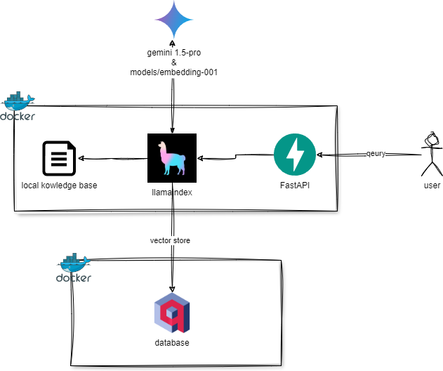
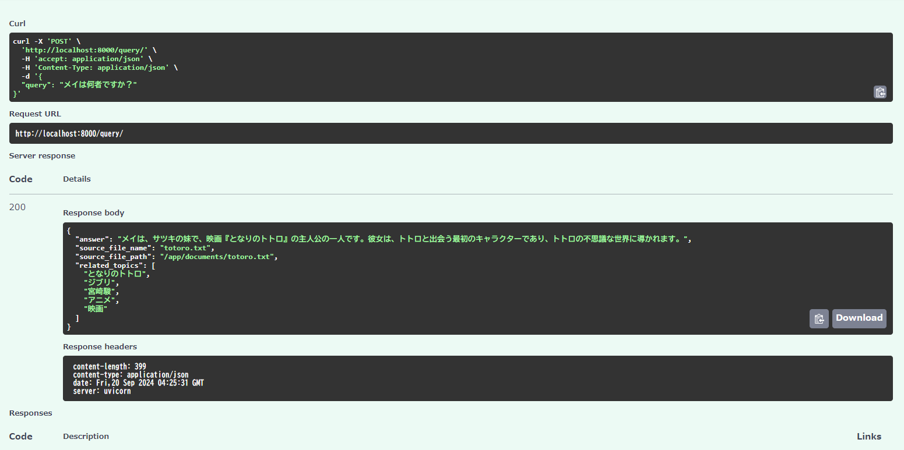
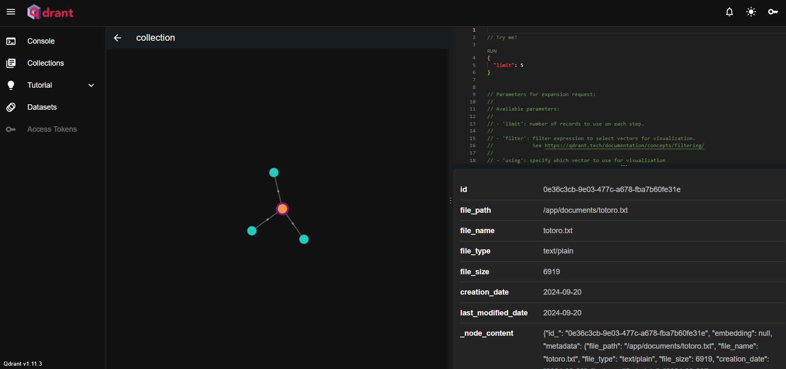

## llamaindex × qdrant × Gemini API × 構造化出力

このリポジトリは、LlamaIndex、Qdrant、Gemini API を使用して、ドキュメントから**構造化データ**を抽出するREST APIのサンプルアプリケーションです。


### 主な機能

* ローカルに保存されたドキュメントに対する自然言語クエリの処理
* Gemini API を利用した回答生成
* pydantic を用いた構造化データ出力 (JSON形式)

## 構成概要



### 前提条件

- Docker がインストールされていること
- Gemini API の APIキーが取得済みであること

### セットアップ

1. **環境変数の設定:**

   ```sh
   cp -a env.example .env 
   ```
   
   `.env` ファイルで、APIキーや接続情報など、必要な環境変数を設定してください。

2. **Docker Compose で起動:**

   ```sh
   docker-compose up -d  
   ```

3. **コンテナに入り、起動**

   ```sh
   docker-compose exec web bash
   python app/main.py
   ```

### 使用方法


#### API ドキュメント

- アプリケーションは、`http://localhost:8000/docs` でアクセスできる Swagger UI で提供されます。
こちらから、API のエンドポイントやリクエストパラメータを確認し、実行することができます。


#### 登録されているドキュメントの確認

- Qdrant Server のダッシュボードは、`http://localhost:6333/dashboard` でアクセスできます。
- こちらから、登録されているドキュメントのベクトルデータやメタデータを確認することができます。


### 技術スタック

* **LlamaIndex:** ドキュメントのインデックス作成とクエリエンジン
* **Qdrant:** ベクトルデータベース (ドキュメントの埋め込みベクトルを格納)
* **Gemini API:** Google AI の大規模言語モデル (高度な意味理解と回答生成)
* **FastAPI:** 高速でモダンな Web API フレームワーク
* **pydantic:** データバリデーションと構造化出力 (JSON)
* **Docker Compose:** 簡単なコンテナ管理

